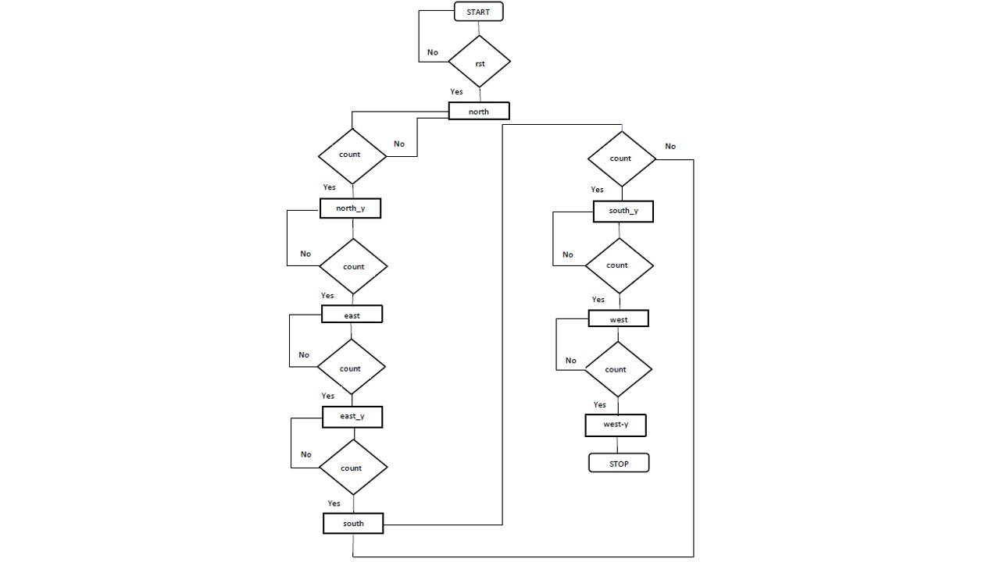

# Traffic-Controller
This project consists of a simple verilog code for traffic controller

Road traffic control involves directing vehicular and pedestrian traffic around a construction zone, accident or other road disruption, thus ensuring the safety of emergency response teams, construction workers and the general public.
The normal function of traffic lights requires more than slight control and coordination to ensure that traffic and pedestrians move as smoothly, and safely as possible. A variety of different control systems are used to accomplish this, ranging from simple clockwork mechanisms to sophisticated computerized control and coordination systems that self-adjust to minimize delay to people using the junction.

Traffic controllers use the concept of phases, which are directions of movement grouped together. For instance, a simple T-junction may have three vehicle movement phases, one for each arm of the junction. There may be additional phases for other movements such as pedestrians, cyclists, bus lanes or tramways.

A stage is a group of non-conflicting phases which move at the same time.

